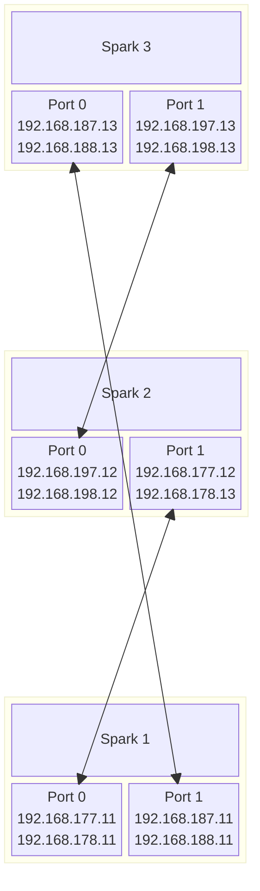
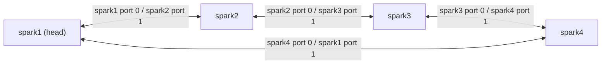

# DGX Spark Networking

The following guide starts with a two-node cluster, but it is also applicable to larger clusters.

See [this post](https://forums.developer.nvidia.com/t/6x-spark-setup/354399/56) for an example of 6-8 node Spark cluster.
Please keep in mind that tensor-parallel vLLM deployments usually work best with a number of nodes that corresponds to a power of 2, such as 2, 4, or 8 nodes. A 3-node mesh is mainly useful for pipeline parallelism or data parallelism.

The guide assumes that the nodes are named `spark` and `spark2`, but you can use any names.
Same with IP addresses: we use `192.168.177.0/24` subnet with `.11` and `.12` assigned to both nodes, but you can use any IP addresses, as long as they are in the same subnet.

For four Sparks connected without a QSFP switch, see the
[four-node ring example](#example-four-node-ring) below.

## Automated cluster setup

Run `setup-cluster.sh` from the head Spark as your normal login user. Supply all
management IPv4 addresses, **head first**. The same username must exist on every
node, with working management SSH and sudo access. Initial passwordless SSH is
not required: the helper asks for an account password when it first needs one,
then reuses it for SSH and sudo across the nodes for the rest of the run. If a
node rejects it, the helper asks for that node's password and remembers the
exception. Different SSH and sudo passwords are supported. Working SSH keys
and passwordless sudo need no password prompt.

Unknown host-key fingerprints still require confirmation; verify them when
asked. Private-key passphrases are requested separately from account passwords.
Passwords remain in memory and are never put in arguments, environment variables,
or files. A temporary local OpenSSH askpass helper receives passwords through a
private Unix socket, and sudo receives them on stdin over SSH. No `sshpass`
package is needed. Password bootstrap uses SSH password authentication; systems
requiring other authentication challenges need working SSH key access first.

Every node needs Ubuntu Netplan (including its Python `yaml` module), Python
3.10+, OpenSSH client/server, `ip`, `ping`, `ssh-keygen`, `runuser`, and the
standard `usermod`/`gpasswd` group-management tools (`groupadd`/`groupdel` if the
`docker` group does not exist). The helper
does not install packages. Only the head needs this repository; the Python node
helper is sent over management SSH. The interface names must match the standard
Spark CX7 names used below. Connect the QSFP cables before running setup.

Preview a two-node configuration (the addresses below are examples):

```bash
./setup-cluster.sh 192.0.2.11 192.0.2.12 --dry-run
```

Apply it after reviewing the preview:

```bash
./setup-cluster.sh 192.0.2.11 192.0.2.12
```

Space- and comma-separated node lists are accepted. With one active QSFP port
per node, the helper selects direct mode for two nodes or switch mode for three
or more. Automatic port detection needs carrier on both twins. This is an inference from link state;
setup still verifies every planned link after applying the configuration.
For direct/switch mode, different nodes can use different physical ports:

```bash
./setup-cluster.sh 192.0.2.11,192.0.2.12 --topology direct --ports 0,1
./setup-cluster.sh 192.0.2.11,192.0.2.12,192.0.2.13 --topology switch --ports 1
```

`--ports 1` selects port 1 everywhere; `--ports 0,1,...` selects a port per node
in input order. Omit it when each node has only one active port. An already
addressed unused CX7 port must be deconfigured first, to avoid confusing launch
autodiscovery. The helper does not configure the switch itself.

For a three-node mesh or a larger closed ring, list nodes in physical cable
order. **Port 0 of each node connects to port 1 of the next node**, including
the cable from the last node back to the head:

```bash
./setup-cluster.sh 192.0.2.11 192.0.2.12 192.0.2.13 --topology mesh
./setup-cluster.sh 192.0.2.11 192.0.2.12 192.0.2.13 192.0.2.14 --topology ring
```

`mesh` means the three-node full mesh, which is also a closed ring. With only
two QSFP ports per Spark, a full mesh of more than three nodes is not possible;
use `ring` or `switch`. Open chains are unsupported. When `lldpctl` is already
available and LLDP neighbors uniquely identify a reciprocal closed ring on both
twins, automatic mode derives the physical order from peer port MAC addresses.
It ignores advertisements from the local twin sharing the same physical port.
An explicit ring order that conflicts with this complete LLDP map is rejected
before changing configuration. The helper does not install or enable LLDP.
If LLDP cannot identify the ring, existing CX7 subnets can also provide its order
when they uniquely agree on both rails.
Carrier alone cannot identify an unconfigured ring's cable order or distinguish
it from a switch with both ports connected. In that case the helper asks for
the topology, or accepts `--topology`; the supplied node order defines ring
cabling. Noninteractive runs must specify an ambiguous topology explicitly.

The helper allocates `/24` networks from `10.20.0.0/16` by default, assigning
host numbers `.11`, `.12`, and so on in topology order. Direct/switch mode uses
two subnets, one per twin. Rings use two distinct subnets per cable, exactly
as in the [four-node example](#example-four-node-ring). Use `--subnet-pool` to
choose another RFC1918 private range with enough `/24` networks:

```bash
./setup-cluster.sh 192.0.2.11 192.0.2.12 --subnet-pool 10.40.0.0/16
```

Choose a different Netplan destination with `--netplan-file`. The path must be
an absolute `.yaml` path directly inside `/etc/netplan`, and is used on every
node. For example, update the existing CX7 file used by the manual guide:

```bash
./setup-cluster.sh 192.0.2.11 192.0.2.12 \
  --netplan-file /etc/netplan/40-cx7.yaml --dry-run
```

The helper replaces the selected CX7 definitions in that file, preserving any
management, Wi-Fi, or other unrelated definitions. It still migrates duplicate
CX7 definitions out of other Netplan files. The original files are backed up
before changes; restore recovers their original contents and permissions. Omit
`--netplan-file` to use `/etc/netplan/98-spark-vllm-docker.yaml`.

Setup rejects overlaps with management and other existing local networks or
routes on any node. It cannot detect subnets used elsewhere on your LAN that
have no local address or route; choose the pool accordingly.

On every node it:

1. Inspects the selected interfaces and validates the combined Netplan
   configuration in a temporary directory before changing live configuration.
2. Saves local backups and migrates exact CX7 Ethernet entries from existing
   `/etc/netplan/*.yaml` files into the selected Netplan file,
   using MTU 9000, static IPv4, DHCP disabled, and no link-local addresses.
   Other interface settings remain in their original files. Migration may
   reformat those YAML files; restore puts their original bytes back.
   Migration avoids accumulating old addresses through
   [Netplan's sequence-merging rules](https://netplan.readthedocs.io/en/stable/netplan-generate/#handling-multiple-files).
3. Creates a separate Ed25519 key on each node in
   `~/.ssh/spark-vllm-cluster/`, exchanges only public keys, and appends them to
   the current user's `authorized_keys`. A block prepended to `~/.ssh/config`
   selects the key and a dedicated verified host-key file for cluster IPs.
   This enables SSH over management and directly reachable CX7 addresses.
4. Applies Netplan on workers and then the head. It checks interface-bound
   jumbo pings (MTU 9000, no fragmentation) on both rails in both directions,
   then checks passwordless SSH from every
   node to every other management IP and each directly reachable CX7 IP.
5. Saves an autodiscovery-compatible `.env` beside `setup-cluster.sh` on the
   head, after all nodes pass verification. Existing unrelated settings and
   comments are preserved. Cluster address/interface fields and the topology's
   NCCL settings replace their previous values; stale cluster fields are removed.

Setup also ensures the current user belongs to the `docker` group on **every
node, including the head**. It creates the group if missing and appends membership
without replacing any other groups. Existing membership is left intact. Open a
new login session afterward so Docker commands in your shell see the new group;
existing SSH sessions retain their old supplementary groups. See Docker's
[post-installation instructions](https://docs.docker.com/engine/install/linux-postinstall/).
This does not install Docker or change its daemon, socket permissions, or containers.

The generated file includes `CLUSTER_NODES`, `LOCAL_IP`, `ETH_IF`, and `IB_IF`.
Direct/switch setups using the same port number on every node use CX7 addresses
for coordination and `COPY_HOSTS`. Rings use management addresses in cable order,
all four HCAs, and both rails of every cable in `CLUSTER_LINKS`. The existing
copy helpers derive routes to every worker from those links. Rings also get the
NCCL routing settings above, with `CONTAINER_NCCL_ALGO=Ring` for four or more nodes.
Direct/switch setups with different port numbers use management coordination,
the union of selected HCAs, and `CLUSTER_LINKS` for CX7 transfers. Management
coordination requires the same management interface name on all nodes because
the launcher uses a single `ETH_IF` value for every rank.

Choose another head configuration path with `--env-file /path/to/cluster.env`,
then pass that path to recipe/launch commands using `--config`. Its parent
directory must already exist and belong to the current user; the directory
and any existing file must not be symlinked, and an existing file must belong
to the current user. New and
updated configuration files use mode `0600`. Use `--no-env` to leave launch
configuration untouched. Existing files must use the repository's single-line
`KEY=value` format; their contents are never executed or printed. The helper
stops if the file changes between the preview and the final save.

For a cluster already configured by the helper (including a setup made before
`.env` generation was added), save the configuration without reapplying networking
or recreating SSH keys:

```bash
./setup-cluster.sh --save-env
```

This uses the existing head manifest and node journals, checks that the saved
addresses and MTUs are active, and verifies CX7 reachability and mutual SSH
before writing. `--env-file` selects a different destination; `--dry-run` checks
the saved configuration and destination without writing. The existing setup's
`--restore` also undoes this save. Repeating the same save keeps the original
backup. A verification failure leaves the existing setup in place.

The helper refuses ambiguous wildcard/MAC/driver Netplan matches, renamed or
bonded/bridged/VLAN-attached CX7 interfaces, vendor/runtime CX7 definitions, and
symlinked files it would change. Resolve these configurations before setup.
It does not change the SSH daemon, management interface definitions,
containers, or recipes. `netplan apply` can briefly interrupt networking, so
run setup when the cluster is idle. `--dry-run` performs inspections, SSH/sudo
authentication, and temporary validation without persistent configuration
changes. `--yes` skips the final plan confirmation for an unattended run;
that run also needs existing SSH trust, login authentication, and noninteractive
sudo access.

If CX7 interfaces are administratively down, specify the topology and (for
direct/switch mode) `--ports`. Netplan brings them up after the original link
state is saved, and final verification checks the cables. An already-up
selected interface without carrier is rejected before setup.

### Checking and repairing a saved setup

Run doctor from the same head and login user:

```bash
./setup-cluster.sh --doctor --dry-run   # Diagnose only; nonzero if issues remain
./setup-cluster.sh --doctor             # Diagnose, review repairs, then apply
./setup-cluster.sh --doctor --yes       # Apply listed repairs without confirmation
```

Doctor uses the existing `--state-file` manifest and node journals, including
older setups. It checks managed files and permissions, saved CX7 addresses,
connected routes, MTUs, carrier, mutual SSH, both rails' jumbo pings, launch
configuration, and Docker access from a fresh user session. An unreachable node
or missing journal is reported before repairs begin. It also reports a stale
Docker group list in the current head login; a new login is required to refresh it.

Repairs can restore missing helper-managed files, correct file permissions,
reapply saved Netplan settings for runtime drift, add missing Docker membership,
and save missing launch configuration. Workers are repaired before the head,
then checks run again. Existing journals keep the original restore baseline.
Recovery images, including private SSH keys and any `.env` credentials, stay in
each node's root-only journal. Older journals can recover matching Netplan files
from their original backups; missing files without a recoverable after-image
are reported for manual recovery.

Doctor preserves later edits to shared files and reports them for reconciliation.
It does not guess new cabling, replace changed SSH host keys, restart Docker,
change firewall/socket permissions, or install missing packages. These issues
remain visible and produce a nonzero exit status. If a repair fails, the journals
remain for another doctor run or `--restore`; it does not roll back the entire
existing cluster. Run network repairs while the cluster is idle because
`netplan apply` can briefly interrupt networking.

`--env-file PATH` selects a launch configuration destination; `--no-env` skips
generation. Doctor respects an explicit `--no-env` saved by setup unless you
provide `--env-file`. Already-journaled configuration files still receive the
normal file-integrity checks.

### Restoring a setup

Run on the same head, as the same user:

```bash
./setup-cluster.sh --restore
```

The default head manifest is `~/.local/state/spark-vllm/cluster-setup.json`.
Use `--state-file /path/to/manifest.json` for both setup and restore to choose
another location. Restore uses the recorded file paths automatically; do not
repeat `--netplan-file` with `--restore`. Each node keeps its original file
contents and permissions in a root-only journal under
`/var/lib/spark-vllm/setup-cluster/`. Keep the head
manifest and node journals until restoration is complete. Only one active
setup per node is supported; restore it before changing topology or addresses.

Restore checks all nodes for file changes before restoring any node. It
restores the original Netplan, SSH, and head `.env` files and their permissions, removes
helper-created files and keys, reapplies the previous Netplan configuration,
removes newly assigned CX7 addresses, and restores previous static addresses,
non-dynamic routes, MTUs, and link state. Dynamic addresses/routes are reacquired
by the previous network configuration. Saved routes use kernel interface IDs;
if those IDs changed after a reboot or driver reload, restore stops for manual
reconciliation instead of assigning routes to the wrong interface. Directories
created by setup are removed only if empty. A head configuration file created
by setup is removed on restore; a pre-existing one is restored byte for byte.
Its backup remains in the head's root-only journal, including any unrelated
credentials it originally contained. The recorded path is used automatically,
so omit `--env-file` when restoring.

Restore removes Docker group membership only when the helper added it, without
changing other memberships. A helper-created `docker` group is removed only
when no users still use it. A changed group ID stops restoration for manual
reconciliation. Existing sessions keep their cached groups until logout.

If any managed file was edited afterward, restore stops and identifies it;
preserve/reconcile those edits before retrying. It never force-overwrites a
later edit. Setup failures and Ctrl-C attempt rollback automatically. If a
node becomes unreachable, a process is killed, or restoration fails, the
journals remain for `--restore` once management access is available again.
Workers are restored before the head, using established management SSH
sessions so removing the generated keys does not prevent the remaining undo.

A CX7 reachability failure can mean that the node list does not match physical
cable order. Check LLDP neighbors when available, or trace each cable from port
0 to the next node's port 1. Restore the failed attempt before retrying setup.

After a successful setup, the generated `.env` is ready for recipe and launch
commands. If you used `--no-env`, or later change the topology, use the normal
discovery workflow to save a launch configuration:

```bash
./run-recipe.sh --discover
```

## DGX Spark ConnectX quirks

DGX Spark has a pretty unique ConnectX setup.

To achieve 200G transfer speed, ConnectX NIC needs ~x8 PCIe 5.0 lanes.

However, DGX Spark SOC can't provide more than x4 PCIe lanes per device due to hardware limitations.
So to achieve 200G on a single cable connection, each physical port shares the same pair of PCIe5 x4 connections.
Each PCIe 5 x4 link is represented by two Ethernet and two RoCE interfaces:

```bash
eugr@spark:~$ ibdev2netdev
rocep1s0f0 port 1 ==> enp1s0f0np0 (Down)
rocep1s0f1 port 1 ==> enp1s0f1np1 (Up)
roceP2p1s0f0 port 1 ==> enP2p1s0f0np0 (Down)
roceP2p1s0f1 port 1 ==> enP2p1s0f1np1 (Up)
```

In this case, the single cable is plugged in the outermost QSFP port (the right one if looking from the back).
This port has two pairs of "twins" associated with it:

- Ethernet: `enp1s0f1np1` and `enP2p1s0f1np1`
- RoCE/IB: `rocep1s0f1` and `roceP2p1s0f1`

Each of the twins represents one PCIe x4 link and can provide up to 100G link speed.

For vLLM, we need RDMA over RoCE, so Ethernet speed is not that important, that's why we can assign IP only to one of the ports - in this case `enp1s0f1np1`.
However, in order to get full bandwidth in NCCL RDMA mode, we need to utilize **both** RoCE twins. It is achieved by setting `NCCL_IB_HCA` to both RoCE interfaces: `export NCCL_IB_HCA=rocep1s0f1,roceP2p1s0f1`

`./launch-cluster.sh` does this automatically, along with autodiscovery of interfaces, so as long as you set up your Ethernet interface properly, vLLM will utilize both RoCE twins.

Also, note that connecting two Sparks using **both** ports won't give you any noticeable advantage in bandwidth, so single connection is sufficient.
If you connect 3 Sparks by daisy-chaining them, you will only be able to sustain 100G between each pair of Sparks.

## Connecting 3 Sparks in a mesh cluster without a switch

Three Sparks can be connected together in a cluster without using a separate RoCE switch.
However, all three Sparks need to be on the same wired network using their 10G Ethernet ports (RJ-45, not QSFP). Being on the same wireless network should work too, but it's not recommended and was not tested.

You need to make sure they are connected the following way: port 0 on one Spark should connect to port 1 on another Spark (unlike non-mesh configuration).
Example diagram:



## Connecting more than 2 Sparks in the cluster using a switch

For a switch-connected cluster, use a suitable QSFP/RoCE switch, for example [Microtik CRS812-DDQ](https://mikrotik.com/product/crs812_ddq) or [Mikrotik CRS804-DDQ](https://mikrotik.com/product/crs804_ddq).
Please refer to [this post](https://forums.developer.nvidia.com/t/6x-spark-setup/354399/56) for an example of setting up a 6-8 node Spark cluster.

## Network setup

### For dual Sparks or multiple Sparks using a QSFP switch

Assuming both are connected using rightmost QSFP port (when looking from the back).

Create `/etc/netplan/40-cx7.yaml` on `spark`:
```yaml
network:
  version: 2
  ethernets:
    enp1s0f1np1:
      dhcp4: no
      dhcp6: no        # Explicitly disable DHCPv6
      link-local: []   # Restrict link-local addresses to static IPv4 only
      mtu: 9000
      addresses: [192.168.177.11/24]
    enP2p1s0f1np1:
      dhcp4: no
      dhcp6: no
      link-local: []
      mtu: 9000
      addresses: [192.168.178.11/24]
```

Create `/etc/netplan/40-cx7.yaml` on `spark2`:
```yaml
network:
  version: 2
  ethernets:
    enp1s0f1np1:
      dhcp4: no
      dhcp6: no        # Explicitly disable DHCPv6
      link-local: []   # Restrict link-local addresses to static IPv4 only
      mtu: 9000
      addresses: [192.168.177.12/24]
    enP2p1s0f1np1:
      dhcp4: no
      dhcp6: no
      link-local: []
      mtu: 9000
      addresses: [192.168.178.12/24]
```

**DO NOT use the same subnet on both "twins"** - it will confuse autodiscovery and mess up routing.

Then run on each node:

```bash
sudo chmod 600 /etc/netplan/40-cx7.yaml
sudo netplan apply
```

Set up passwordless ssh. On spark:

```bash
wget https://raw.githubusercontent.com/NVIDIA/dgx-spark-playbooks/refs/heads/main/nvidia/connect-two-sparks/assets/discover-sparks
chmod +x discover-sparks
./discover-sparks
```

MTU setting (testing):

```bash
sudo ip link set dev enp1s0f1np1 mtu 9000
```

### For 3-node mesh

3-node mesh is configured differently than dual clusters or clusters using a QSFP switch.

Assuming, your Sparks are connected according to the diagram above:

Create `/etc/netplan/40-cx7.yaml` on `spark1`:
```yaml
network:
  version: 2
  ethernets:
    enp1s0f0np0:
      dhcp4: no
      dhcp6: no        # Explicitly disable DHCPv6
      link-local: []   # Restrict link-local addresses to static IPv4 only
      mtu: 9000
      addresses: [192.168.177.11/24]
    enP2p1s0f0np0:
      dhcp4: no
      dhcp6: no
      link-local: []
      mtu: 9000
      addresses: [192.168.178.11/24]
    enp1s0f1np1:
      dhcp4: no
      dhcp6: no        # Explicitly disable DHCPv6
      link-local: []   # Restrict link-local addresses to static IPv4 only
      mtu: 9000
      addresses: [192.168.187.11/24]
    enP2p1s0f1np1:
      dhcp4: no
      dhcp6: no
      link-local: []
      mtu: 9000
      addresses: [192.168.188.11/24]
```

Create `/etc/netplan/40-cx7.yaml` on `spark2`:
```yaml
network:
  version: 2
  ethernets:
    enp1s0f0np0:
      dhcp4: no
      dhcp6: no        # Explicitly disable DHCPv6
      link-local: []   # Restrict link-local addresses to static IPv4 only
      mtu: 9000
      addresses: [192.168.197.12/24]
    enP2p1s0f0np0:
      dhcp4: no
      dhcp6: no
      link-local: []
      mtu: 9000
      addresses: [192.168.198.12/24]
    enp1s0f1np1:
      dhcp4: no
      dhcp6: no        # Explicitly disable DHCPv6
      link-local: []   # Restrict link-local addresses to static IPv4 only
      mtu: 9000
      addresses: [192.168.177.12/24]
    enP2p1s0f1np1:
      dhcp4: no
      dhcp6: no
      link-local: []
      mtu: 9000
      addresses: [192.168.178.12/24]
```

Create `/etc/netplan/40-cx7.yaml` on `spark3`:
```yaml
network:
  version: 2
  ethernets:
    enp1s0f0np0:
      dhcp4: no
      dhcp6: no        # Explicitly disable DHCPv6
      link-local: []   # Restrict link-local addresses to static IPv4 only
      mtu: 9000
      addresses: [192.168.187.13/24]
    enP2p1s0f0np0:
      dhcp4: no
      dhcp6: no
      link-local: []
      mtu: 9000
      addresses: [192.168.188.13/24]
    enp1s0f1np1:
      dhcp4: no
      dhcp6: no        # Explicitly disable DHCPv6
      link-local: []   # Restrict link-local addresses to static IPv4 only
      mtu: 9000
      addresses: [192.168.197.13/24]
    enP2p1s0f1np1:
      dhcp4: no
      dhcp6: no
      link-local: []
      mtu: 9000
      addresses: [192.168.198.13/24]
```

Then run (on each Spark):

```bash
sudo chmod 600 /etc/netplan/40-cx7.yaml
sudo netplan apply
```

### Passwordless SSH and benchmarks

Set up passwordless ssh. On the first spark:

```bash
wget https://raw.githubusercontent.com/NVIDIA/dgx-spark-playbooks/refs/heads/main/nvidia/connect-two-sparks/assets/discover-sparks
chmod +x discover-sparks
./discover-sparks
```

**Benchmark connection (use perftest package):**

Run the receiver on `spark2` node:

```bash
ib_write_bw -d rocep1s0f1 --report_gbits -q 4 -R --force-link IB
```

Then run on `spark`:

```bash
$ ib_write_bw 192.168.177.12 -d rocep1s0f1 --report_gbits -q 4 -R --force-link IB
```

```
---------------------------------------------------------------------------------------
                    RDMA_Write BW Test
 Dual-port       : OFF          Device         : rocep1s0f1
 Number of qps   : 4            Transport type : IB
 Connection type : RC           Using SRQ      : OFF
 PCIe relax order: ON
 ibv_wr* API     : ON
 TX depth        : 128
 CQ Moderation   : 1
 Mtu             : 1024[B]
 Link type       : IB
 Max inline data : 0[B]
 rdma_cm QPs     : ON
 Data ex. method : rdma_cm
---------------------------------------------------------------------------------------
 local address: LID 0000 QPN 0x03ec PSN 0xb680ae
 local address: LID 0000 QPN 0x03ed PSN 0x808800
 local address: LID 0000 QPN 0x03ee PSN 0x5b694a
 local address: LID 0000 QPN 0x03ef PSN 0xe2efd1
 remote address: LID 0000 QPN 0x03eb PSN 0x75f6ee
 remote address: LID 0000 QPN 0x03ec PSN 0x436140
 remote address: LID 0000 QPN 0x03ed PSN 0x81698a
 remote address: LID 0000 QPN 0x03ee PSN 0x4a8b11
---------------------------------------------------------------------------------------
 #bytes     #iterations    BW peak[Gb/sec]    BW average[Gb/sec]   MsgRate[Mpps]
 65536      20000            111.72             111.71             0.213070
---------------------------------------------------------------------------------------
```

**Latency test:**

Run the receiver on `spark2` node:

```bash
ib_write_lat -d rocep1s0f1 --report_gbits -R --force-link IB
```

Then run on `spark`:

```bash
ib_write_lat 192.168.177.12 -d rocep1s0f1 --report_gbits -R --force-link IB
```

```
---------------------------------------------------------------------------------------
                    RDMA_Write Latency Test
 Dual-port       : OFF          Device         : rocep1s0f1
 Number of qps   : 1            Transport type : IB
 Connection type : RC           Using SRQ      : OFF
 PCIe relax order: OFF
 ibv_wr* API     : ON
 TX depth        : 1
 Mtu             : 1024[B]
 Link type       : IB
 Max inline data : 220[B]
 rdma_cm QPs     : ON
 Data ex. method : rdma_cm
---------------------------------------------------------------------------------------
 local address: LID 0000 QPN 0x02ee PSN 0xb0c21c
 remote address: LID 0000 QPN 0x02ee PSN 0x14568b
---------------------------------------------------------------------------------------
 #bytes #iterations    t_min[usec]    t_max[usec]  t_typical[usec]    t_avg[usec]    t_stdev[usec]   99% percentile[usec]   99.9% percentile[usec]
 2       1000          1.42           1.93         1.47                1.47             0.00            1.57                    1.93
---------------------------------------------------------------------------------------
```

## NCCL Tests

### Dual Sparks or Sparks via QSFP switch

From https://build.nvidia.com/spark/nccl/stacked-sparks

```bash
# Install dependencies and build NCCL
sudo apt-get update && sudo apt-get install -y libopenmpi-dev
git clone -b v2.30u1 https://github.com/NVIDIA/nccl.git ~/nccl/
cd ~/nccl/
make -j src.build NVCC_GENCODE="-gencode=arch=compute_121,code=sm_121"

# Set environment variables
export CUDA_HOME="/usr/local/cuda"
export MPI_HOME="/usr/lib/aarch64-linux-gnu/openmpi"
export NCCL_HOME="$HOME/nccl/build/"
export LD_LIBRARY_PATH="$NCCL_HOME/lib:$CUDA_HOME/lib64/:$MPI_HOME/lib:$LD_LIBRARY_PATH"
```

Build NCCL Test Suite:

```bash
# Clone and build NCCL tests
git clone https://github.com/NVIDIA/nccl-tests.git ~/nccl-tests/
cd ~/nccl-tests/
make MPI=1
```

Test on both nodes:

```bash
# Set network interface environment variables (use your active interface)
export UCX_NET_DEVICES=enp1s0f1np1
export NCCL_SOCKET_IFNAME=enp1s0f1np1
export OMPI_MCA_btl_tcp_if_include=enp1s0f1np1
export NCCL_IB_HCA=rocep1s0f1,roceP2p1s0f1
export NCCL_IB_DISABLE=0

# Run the all_gather performance test across both nodes
mpirun -np 2 -H 192.168.177.11:1,192.168.177.12:1 \
  --mca plm_rsh_agent "ssh -o UserKnownHostsFile=/dev/null -o StrictHostKeyChecking=no" \
  -x LD_LIBRARY_PATH=$LD_LIBRARY_PATH \
  $HOME/nccl-tests/build/all_gather_perf -b 16G -e 16G -f 2

```

### 3-node mesh

```bash
# Install dependencies and build NCCL
sudo apt-get update && sudo apt-get install -y libopenmpi-dev
git clone -b v2.30u1 https://github.com/NVIDIA/nccl.git ~/nccl/
cd ~/nccl/
make -j src.build NVCC_GENCODE="-gencode=arch=compute_121,code=sm_121"

# Set environment variables
export CUDA_HOME="/usr/local/cuda"
export MPI_HOME="/usr/lib/aarch64-linux-gnu/openmpi"
export NCCL_HOME="$HOME/nccl/build/"
export LD_LIBRARY_PATH="$NCCL_HOME/lib:$CUDA_HOME/lib64/:$MPI_HOME/lib:$LD_LIBRARY_PATH"
```

Build NCCL Test Suite:

```bash
# Clone and build NCCL tests
git clone https://github.com/NVIDIA/nccl-tests.git ~/nccl-tests/
cd ~/nccl-tests/
make MPI=1
```

Test on all three nodes (replace `spark1`, `spark2`, and `spark3` with the actual hostnames or IP addresses on the non-QSFP interface):

```bash
# Set environment variables
export CUDA_HOME="/usr/local/cuda"
export MPI_HOME="/usr/lib/aarch64-linux-gnu/openmpi"
export NCCL_HOME="$HOME/nccl/build/"
export LD_LIBRARY_PATH="$NCCL_HOME/lib:$CUDA_HOME/lib64/:$MPI_HOME/lib:$LD_LIBRARY_PATH"

# For 3-node mesh we have to use 10G interface for OOB communication!
export UCX_NET_DEVICES=enP7s7
export NCCL_SOCKET_IFNAME=enP7s7
export OMPI_MCA_btl_tcp_if_include=enP7s7
export NCCL_IB_HCA=rocep1s0f0,roceP2p1s0f0,rocep1s0f1,roceP2p1s0f1
export NCCL_IB_DISABLE=0

# Run the all_gather performance test across all three nodes
mpirun -np 3 -H spark1:1,spark2:1,spark3:1 \
  --mca plm_rsh_agent "ssh -o UserKnownHostsFile=/dev/null -o StrictHostKeyChecking=no" \
  -x LD_LIBRARY_PATH=$LD_LIBRARY_PATH -x NCCL_IB_MERGE_NICS=0 -x NCCL_NET_PLUGIN=none -x NCCL_IB_SUBNET_AWARE_ROUTING=1 \
  $HOME/nccl-tests/build/all_gather_perf -b 16G -e 16G -f 3
```

## Closed rings of four or more Sparks

A closed ring connects each Spark's two QSFP ports to two different neighbors.
Keep all nodes on the management network and configure passwordless SSH similarly to other topologies. 

Assign each link's addressed CX-7 interfaces their
own subnet, as in the three-node mesh setup above. Discovery requires Python 3,
`ibdev2netdev`, `ip`, and `ping` on every node.

### Example: four-node ring

Use four QSFP cables to connect `spark1 -> spark2 -> spark3 -> spark4 -> spark1`.
Connect port 0 of each Spark to port 1 of the next Spark, including the closing
cable from `spark4` to `spark1`:



All four Sparks also connect to the same management LAN through their RJ-45
ports. The example assumes these management identities on `enP7s7`:

| Node | Management address | Rank |
| :--- | :--- | :--- |
| `spark1` | `192.0.2.11` | 0 (head) |
| `spark2` | `192.0.2.12` | 1 |
| `spark3` | `192.0.2.13` | 2 |
| `spark4` | `192.0.2.14` | 3 |

These are documentation addresses; use the nodes' actual management addresses.
Keep the management LAN configuration in its existing netplan file. The CX-7
examples below use eight separate `/24` subnets: two per cable, one for each
PCIe rail. Choose subnets that do not overlap your other networks.

| Cable | First endpoint | Second endpoint | CX-7 subnets |
| :--- | :--- | :--- | :--- |
| 1 | `spark1` port 0 | `spark2` port 1 | `10.20.0.0/24`, `10.20.1.0/24` |
| 2 | `spark2` port 0 | `spark3` port 1 | `10.20.2.0/24`, `10.20.3.0/24` |
| 3 | `spark3` port 0 | `spark4` port 1 | `10.20.4.0/24`, `10.20.5.0/24` |
| 4 | `spark4` port 0 | `spark1` port 1 | `10.20.6.0/24`, `10.20.7.0/24` |

Port 0 uses `enp1s0f0np0` and `enP2p1s0f0np0`; port 1 uses
`enp1s0f1np1` and `enP2p1s0f1np1`. Both endpoints of each rail must use the
same subnet and MTU. This example uses MTU 9000 throughout.

Create `/etc/netplan/40-cx7.yaml` on each node with its corresponding content
below. If those interfaces already have netplan definitions, update those
definitions to match the example instead of adding duplicate entries.

**spark1:**

```yaml
network:
  version: 2
  ethernets:
    enp1s0f0np0:
      dhcp4: no
      dhcp6: no
      link-local: []
      mtu: 9000
      addresses: [10.20.0.11/24]
    enP2p1s0f0np0:
      dhcp4: no
      dhcp6: no
      link-local: []
      mtu: 9000
      addresses: [10.20.1.11/24]
    enp1s0f1np1:
      dhcp4: no
      dhcp6: no
      link-local: []
      mtu: 9000
      addresses: [10.20.6.11/24]
    enP2p1s0f1np1:
      dhcp4: no
      dhcp6: no
      link-local: []
      mtu: 9000
      addresses: [10.20.7.11/24]
```

**spark2:**

```yaml
network:
  version: 2
  ethernets:
    enp1s0f0np0:
      dhcp4: no
      dhcp6: no
      link-local: []
      mtu: 9000
      addresses: [10.20.2.12/24]
    enP2p1s0f0np0:
      dhcp4: no
      dhcp6: no
      link-local: []
      mtu: 9000
      addresses: [10.20.3.12/24]
    enp1s0f1np1:
      dhcp4: no
      dhcp6: no
      link-local: []
      mtu: 9000
      addresses: [10.20.0.12/24]
    enP2p1s0f1np1:
      dhcp4: no
      dhcp6: no
      link-local: []
      mtu: 9000
      addresses: [10.20.1.12/24]
```

**spark3:**

```yaml
network:
  version: 2
  ethernets:
    enp1s0f0np0:
      dhcp4: no
      dhcp6: no
      link-local: []
      mtu: 9000
      addresses: [10.20.4.13/24]
    enP2p1s0f0np0:
      dhcp4: no
      dhcp6: no
      link-local: []
      mtu: 9000
      addresses: [10.20.5.13/24]
    enp1s0f1np1:
      dhcp4: no
      dhcp6: no
      link-local: []
      mtu: 9000
      addresses: [10.20.2.13/24]
    enP2p1s0f1np1:
      dhcp4: no
      dhcp6: no
      link-local: []
      mtu: 9000
      addresses: [10.20.3.13/24]
```

**spark4:**

```yaml
network:
  version: 2
  ethernets:
    enp1s0f0np0:
      dhcp4: no
      dhcp6: no
      link-local: []
      mtu: 9000
      addresses: [10.20.6.14/24]
    enP2p1s0f0np0:
      dhcp4: no
      dhcp6: no
      link-local: []
      mtu: 9000
      addresses: [10.20.7.14/24]
    enp1s0f1np1:
      dhcp4: no
      dhcp6: no
      link-local: []
      mtu: 9000
      addresses: [10.20.4.14/24]
    enP2p1s0f1np1:
      dhcp4: no
      dhcp6: no
      link-local: []
      mtu: 9000
      addresses: [10.20.5.14/24]
```

On each node, validate and apply its configuration:

```bash
sudo chmod 600 /etc/netplan/40-cx7.yaml
sudo netplan generate
sudo netplan apply
ibdev2netdev
```

All four RoCE interfaces should report `Up`. Check the two neighbors from each
node, binding each ping to the matching interface. For example, on `spark1`:

```bash
# spark2, reached through spark1 port 0
ping -c 3 -I enp1s0f0np0 10.20.0.12
ping -c 3 -I enP2p1s0f0np0 10.20.1.12
# spark4, reached through spark1 port 1
ping -c 3 -I enp1s0f1np1 10.20.6.14
ping -c 3 -I enP2p1s0f1np1 10.20.7.14
```

Use the existing [passwordless SSH configurator](#passwordless-ssh-and-benchmarks)
to enable access from the head to every node. With `spark1` as head, the expected
rank order is `spark1, spark2, spark3, spark4`; `spark3` is the indirect copy
destination and is reached through `spark2`. Discovery derives that path from
the links, without extra SSH-user or jump-host fields in `.env`.

### Discovery, distribution, and launch

Management discovery already finds the whole cluster. With four or more nodes
in mesh mode, discovery also inspects the active RoCE interfaces on each node
and verifies matching subnets in both directions. It counts the twin rails as
one neighbor. When the resulting graph is a closed ring, it orders
`CLUSTER_NODES` along that ring, with the local node first, and saves the link
endpoints in the same `.env` file:

```bash
./run-recipe.sh --discover
```

The only new field is `CLUSTER_LINKS`: a single-line JSON list of links, enclosed
in single quotes. Each link maps two management IPv4 addresses to their
respective CX-7 IPv4 addresses. For the four-node example above, the generated
rank order and first rail of each cable look like this:

```dotenv
CLUSTER_NODES=192.0.2.11,192.0.2.12,192.0.2.13,192.0.2.14
CLUSTER_LINKS='[{"192.0.2.11":"10.20.0.11","192.0.2.12":"10.20.0.12"},{"192.0.2.12":"10.20.2.12","192.0.2.13":"10.20.2.13"},{"192.0.2.13":"10.20.4.13","192.0.2.14":"10.20.4.14"},{"192.0.2.14":"10.20.6.14","192.0.2.11":"10.20.6.11"}]'
```

This example shows one rail per cable; discovery saves every verified addressed
rail. Existing `LOCAL_IP`, `ETH_IF`, and `IB_IF` fields remain in the file.
Discovery also saves the existing NCCL settings `CONTAINER_NCCL_ALGO=Ring`,
`CONTAINER_NCCL_NET_PLUGIN=none`, `CONTAINER_NCCL_IB_SUBNET_AWARE_ROUTING=1`, and
`CONTAINER_NCCL_IB_MERGE_NICS=0`. There is no additional topology type, rank-order
list, SSH user, or saved copy-route table.

For a ring, launch validation checks the selected ranks, including any trimming
caused by the requested parallelism. The native backend preserves rank placement;
Ray and mixed TP/PP/DP layouts are currently rejected for a sparse ring. Use the
full ring with tensor parallelism, a directly connected pair, or solo mode.
Selecting three nodes from a four-node ring breaks its closing link and is
rejected before containers start. Ring defaults are supplied when omitted;
conflicting NCCL settings are rejected. Automatic NCCL algorithm selection may
attempt connections between non-neighbor nodes, which caused QP timeouts in the
four-node validation. SSH jump paths do not provide RDMA routing for NCCL.

Image and model distribution derive shortest paths through the saved links.
Direct neighbors receive transfers directly; other nodes use SSH `ProxyJump`
through as many intermediate nodes as needed, without staging weights or images
on those nodes. These are TCP transfers over CX-7; every jump host must permit
SSH TCP forwarding.
Existing SSH identities, authentication, and host-key configuration are reused.
Temporary SSH routing files are removed when each transfer finishes.

There is no four-node limit in discovery or distribution. For example, the
farthest destination in a six-node ring uses two jump hosts; in an eight-node
ring it uses three. Mocked integration tests cover discovery, rank validation,
and image/model distribution to every worker in both serial and parallel modes
for those sizes. Physical NCCL inference has been validated on four nodes;
larger-ring inference still needs validation with the intended model and tensor
parallel size. Each copy originates at the head, so concurrent transfers share
link bandwidth and SSH forwarding capacity; distribution throughput does not
scale linearly with the number of nodes.

```bash
# Preview the four-node launch before setup
./run-recipe.sh recipes/qwen3.8-27b-nvfp4-dflash2.yaml --tp 4 --dry-run
# Download/build as needed, distribute to all workers, and launch
./run-recipe.sh recipes/qwen3.8-27b-nvfp4-dflash2.yaml --tp 4 --setup
```

To distribute an existing image or a model separately:

```bash
./build-and-copy.sh --no-build -c --copy-parallel
./hf-download.sh org/model -c --copy-parallel
```

New ring configs omit `COPY_HOSTS`, so `-c` includes every worker. Explicit
`--copy-to` hosts or an explicitly saved `COPY_HOSTS` subset still select only
those destinations. Management addresses and saved link addresses are accepted
as destinations. Recipe setup forwards the selected config to both copy scripts,
compares image IDs through the same routes, and distributes models even when
already cached on the head.

Two-node, three-node mesh, and switch-connected configurations retain their
existing discovery, NCCL, and `COPY_HOSTS` behavior. A complete graph discovered
with four active NICs follows the legacy copy scan. Autodiscovery leaves
`NCCL_ALGO` unset on those topologies; it sets `Ring` for a true ring. Existing
config files without `CLUSTER_LINKS` continue to work unchanged; rediscover to
enable ring support.
Saved links describe the network at discovery time. Run discovery again after
recabling or changing addresses; copy failures do not silently fall back to the
management network.
